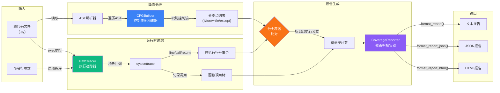

# PathTracer 系统架构图

展示pathtracer模块的核心组件及其数据流向。

```mermaid
flowchart LR
    subgraph 输入
        source["源代码文件<br/>(.py)"]
        args["命令行参数"]
    end

    subgraph 静态分析
        cfg["CFGBuilder<br/>控制流图构建器"]
        ast["AST解析器"]
        branches["分支点列表<br/>(if/for/while/except)"]
    end

    subgraph 运行时追踪
        tracer["PathTracer<br/>执行追踪器"]
        settrace["sys.settrace"]
        execlines["已执行行号集合"]
        calltree["函数调用树"]
    end

    subgraph 报告生成
        reporter["CoverageReporter<br/>覆盖率报告器"]
        compare{"分支覆盖<br/>比对"}
        calc["覆盖率计算"]
    end

    subgraph 输出
        text["文本报告"]
        json["JSON报告"]
        html["HTML报告"]
    end

    source -->|"读取"| ast
    ast -->|"遍历AST"| cfg
    cfg -->|"识别控制流"| branches

    args -->|"启动程序"| tracer
    source -->|"exec执行"| tracer
    tracer -->|"注册回调"| settrace
    settrace -->|"line/call/return"| execlines
    settrace -->|"记录调用"| calltree

    branches --> compare
    execlines --> compare
    compare -->|"标记已执行分支"| calc
    calltree --> calc
    calc --> reporter

    reporter -->|"format_report()"| text
    reporter -->|"format_report_json()"| json
    reporter -->|"format_report_html()"| html

    style cfg fill:#3B82F6,color:#fff
    style tracer fill:#10B981,color:#fff
    style reporter fill:#8B5CF6,color:#fff
    style compare fill:#F97316,color:#fff
```
